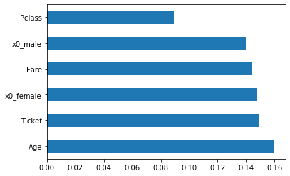
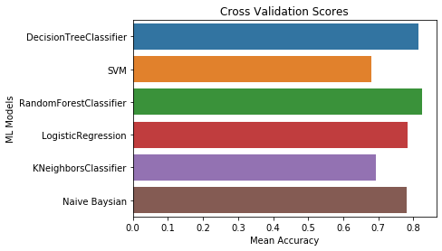

# Application of Bagging on Titanic Dataset

## Data preparation


```python
import numpy as np
import pandas as pd
import matplotlib.pyplot as plt
import seaborn as sns
train = pd.read_csv("train.csv", header = 0)
test = pd.read_csv("test.csv", header = 0)
```


```python
train.head()
```


<div>
<style scoped>
    .dataframe tbody tr th:only-of-type {
        vertical-align: middle;
    }

    .dataframe tbody tr th {
        vertical-align: top;
    }

    .dataframe thead th {
        text-align: right;
    }
</style>
<table border="1" class="dataframe">
  <thead>
    <tr style="text-align: right;">
      <th></th>
      <th>PassengerId</th>
      <th>Survived</th>
      <th>Pclass</th>
      <th>Name</th>
      <th>Sex</th>
      <th>Age</th>
      <th>SibSp</th>
      <th>Parch</th>
      <th>Ticket</th>
      <th>Fare</th>
      <th>Cabin</th>
      <th>Embarked</th>
    </tr>
  </thead>
  <tbody>
    <tr>
      <th>0</th>
      <td>1</td>
      <td>0</td>
      <td>3</td>
      <td>Braund, Mr. Owen Harris</td>
      <td>male</td>
      <td>22.0</td>
      <td>1</td>
      <td>0</td>
      <td>A/5 21171</td>
      <td>7.2500</td>
      <td>NaN</td>
      <td>S</td>
    </tr>
    <tr>
      <th>1</th>
      <td>2</td>
      <td>1</td>
      <td>1</td>
      <td>Cumings, Mrs. John Bradley (Florence Briggs Th...</td>
      <td>female</td>
      <td>38.0</td>
      <td>1</td>
      <td>0</td>
      <td>PC 17599</td>
      <td>71.2833</td>
      <td>C85</td>
      <td>C</td>
    </tr>
    <tr>
      <th>2</th>
      <td>3</td>
      <td>1</td>
      <td>3</td>
      <td>Heikkinen, Miss. Laina</td>
      <td>female</td>
      <td>26.0</td>
      <td>0</td>
      <td>0</td>
      <td>STON/O2. 3101282</td>
      <td>7.9250</td>
      <td>NaN</td>
      <td>S</td>
    </tr>
    <tr>
      <th>3</th>
      <td>4</td>
      <td>1</td>
      <td>1</td>
      <td>Futrelle, Mrs. Jacques Heath (Lily May Peel)</td>
      <td>female</td>
      <td>35.0</td>
      <td>1</td>
      <td>0</td>
      <td>113803</td>
      <td>53.1000</td>
      <td>C123</td>
      <td>S</td>
    </tr>
    <tr>
      <th>4</th>
      <td>5</td>
      <td>0</td>
      <td>3</td>
      <td>Allen, Mr. William Henry</td>
      <td>male</td>
      <td>35.0</td>
      <td>0</td>
      <td>0</td>
      <td>373450</td>
      <td>8.0500</td>
      <td>NaN</td>
      <td>S</td>
    </tr>
  </tbody>
</table>
</div>


```python
test.head()
```


<div>
<style scoped>
    .dataframe tbody tr th:only-of-type {
        vertical-align: middle;
    }

    .dataframe tbody tr th {
        vertical-align: top;
    }

    .dataframe thead th {
        text-align: right;
    }
</style>
<table border="1" class="dataframe">
  <thead>
    <tr style="text-align: right;">
      <th></th>
      <th>PassengerId</th>
      <th>Pclass</th>
      <th>Name</th>
      <th>Sex</th>
      <th>Age</th>
      <th>SibSp</th>
      <th>Parch</th>
      <th>Ticket</th>
      <th>Fare</th>
      <th>Cabin</th>
      <th>Embarked</th>
    </tr>
  </thead>
  <tbody>
    <tr>
      <th>0</th>
      <td>892</td>
      <td>3</td>
      <td>Kelly, Mr. James</td>
      <td>male</td>
      <td>34.5</td>
      <td>0</td>
      <td>0</td>
      <td>330911</td>
      <td>7.8292</td>
      <td>NaN</td>
      <td>Q</td>
    </tr>
    <tr>
      <th>1</th>
      <td>893</td>
      <td>3</td>
      <td>Wilkes, Mrs. James (Ellen Needs)</td>
      <td>female</td>
      <td>47.0</td>
      <td>1</td>
      <td>0</td>
      <td>363272</td>
      <td>7.0000</td>
      <td>NaN</td>
      <td>S</td>
    </tr>
    <tr>
      <th>2</th>
      <td>894</td>
      <td>2</td>
      <td>Myles, Mr. Thomas Francis</td>
      <td>male</td>
      <td>62.0</td>
      <td>0</td>
      <td>0</td>
      <td>240276</td>
      <td>9.6875</td>
      <td>NaN</td>
      <td>Q</td>
    </tr>
    <tr>
      <th>3</th>
      <td>895</td>
      <td>3</td>
      <td>Wirz, Mr. Albert</td>
      <td>male</td>
      <td>27.0</td>
      <td>0</td>
      <td>0</td>
      <td>315154</td>
      <td>8.6625</td>
      <td>NaN</td>
      <td>S</td>
    </tr>
    <tr>
      <th>4</th>
      <td>896</td>
      <td>3</td>
      <td>Hirvonen, Mrs. Alexander (Helga E Lindqvist)</td>
      <td>female</td>
      <td>22.0</td>
      <td>1</td>
      <td>1</td>
      <td>3101298</td>
      <td>12.2875</td>
      <td>NaN</td>
      <td>S</td>
    </tr>
  </tbody>
</table>
</div>


## Clean the data
From the following analysis we know there is only cabin feature has null values. I will use Imputer to handle those null values.


```python
train.isnull().describe()
```


<div>
<style scoped>
    .dataframe tbody tr th:only-of-type {
        vertical-align: middle;
    }

    .dataframe tbody tr th {
        vertical-align: top;
    }

    .dataframe thead th {
        text-align: right;
    }
</style>
<table border="1" class="dataframe">
  <thead>
    <tr style="text-align: right;">
      <th></th>
      <th>PassengerId</th>
      <th>Survived</th>
      <th>Pclass</th>
      <th>Name</th>
      <th>Sex</th>
      <th>Age</th>
      <th>SibSp</th>
      <th>Parch</th>
      <th>Ticket</th>
      <th>Fare</th>
      <th>Cabin</th>
      <th>Embarked</th>
    </tr>
  </thead>
  <tbody>
    <tr>
      <th>count</th>
      <td>891</td>
      <td>891</td>
      <td>891</td>
      <td>891</td>
      <td>891</td>
      <td>891</td>
      <td>891</td>
      <td>891</td>
      <td>891</td>
      <td>891</td>
      <td>891</td>
      <td>891</td>
    </tr>
    <tr>
      <th>unique</th>
      <td>1</td>
      <td>1</td>
      <td>1</td>
      <td>1</td>
      <td>1</td>
      <td>2</td>
      <td>1</td>
      <td>1</td>
      <td>1</td>
      <td>1</td>
      <td>2</td>
      <td>2</td>
    </tr>
    <tr>
      <th>top</th>
      <td>False</td>
      <td>False</td>
      <td>False</td>
      <td>False</td>
      <td>False</td>
      <td>False</td>
      <td>False</td>
      <td>False</td>
      <td>False</td>
      <td>False</td>
      <td>True</td>
      <td>False</td>
    </tr>
    <tr>
      <th>freq</th>
      <td>891</td>
      <td>891</td>
      <td>891</td>
      <td>891</td>
      <td>891</td>
      <td>714</td>
      <td>891</td>
      <td>891</td>
      <td>891</td>
      <td>891</td>
      <td>687</td>
      <td>889</td>
    </tr>
  </tbody>
</table>
</div>


```python
test.isnull().describe()
```


<div>
<style scoped>
    .dataframe tbody tr th:only-of-type {
        vertical-align: middle;
    }

    .dataframe tbody tr th {
        vertical-align: top;
    }

    .dataframe thead th {
        text-align: right;
    }
</style>
<table border="1" class="dataframe">
  <thead>
    <tr style="text-align: right;">
      <th></th>
      <th>PassengerId</th>
      <th>Pclass</th>
      <th>Name</th>
      <th>Sex</th>
      <th>Age</th>
      <th>SibSp</th>
      <th>Parch</th>
      <th>Ticket</th>
      <th>Fare</th>
      <th>Cabin</th>
      <th>Embarked</th>
    </tr>
  </thead>
  <tbody>
    <tr>
      <th>count</th>
      <td>418</td>
      <td>418</td>
      <td>418</td>
      <td>418</td>
      <td>418</td>
      <td>418</td>
      <td>418</td>
      <td>418</td>
      <td>418</td>
      <td>418</td>
      <td>418</td>
    </tr>
    <tr>
      <th>unique</th>
      <td>1</td>
      <td>1</td>
      <td>1</td>
      <td>1</td>
      <td>2</td>
      <td>1</td>
      <td>1</td>
      <td>1</td>
      <td>2</td>
      <td>2</td>
      <td>1</td>
    </tr>
    <tr>
      <th>top</th>
      <td>False</td>
      <td>False</td>
      <td>False</td>
      <td>False</td>
      <td>False</td>
      <td>False</td>
      <td>False</td>
      <td>False</td>
      <td>False</td>
      <td>True</td>
      <td>False</td>
    </tr>
    <tr>
      <th>freq</th>
      <td>418</td>
      <td>418</td>
      <td>418</td>
      <td>418</td>
      <td>332</td>
      <td>418</td>
      <td>418</td>
      <td>418</td>
      <td>417</td>
      <td>327</td>
      <td>418</td>
    </tr>
  </tbody>
</table>
</div>


```python
from sklearn.impute import SimpleImputer
SI = SimpleImputer(strategy="most_frequent")
train['Cabin'].unique()

#Imputation for Cabin and Embarked
train_impute = pd.DataFrame(SI.fit_transform(train[["Cabin","Embarked"]]))
test_impute = pd.DataFrame(SI.transform(test[["Cabin" ,"Embarked"]]))

train[["Cabin","Embarked"]] = train_impute
test[["Cabin","Embarked"]] = test_impute

#Imputation for age and Fare
SI_num = SimpleImputer(strategy="mean")
train_impute = pd.DataFrame(SI_num.fit_transform(train[["Age","Fare"]]))
test_impute = pd.DataFrame(SI_num.transform(test[["Age" ,"Fare"]]))

train[["Age" ,"Fare"]] = train_impute
test[["Age" ,"Fare"]] = test_impute
```

## Handle Categorital features


```python
handle_train = train.drop('Survived', axis = 1)
feature_ob = (handle_train.dtypes == object)
feature_ob
```


    PassengerId    False
    Pclass         False
    Name            True
    Sex             True
    Age            False
    SibSp          False
    Parch          False
    Ticket          True
    Fare           False
    Cabin           True
    Embarked        True
    dtype: bool


```python
# Select types
train_obj = handle_train.iloc[:,feature_ob.values]
test_obj = test.iloc[:,feature_ob.values]

train_obj.describe().loc['unique']

#From the unique value, we can use OneHotEncoder for Sex and Embarked and Label Encoding for Ticket and Cabin
```


    Name        891
    Sex           2
    Ticket      681
    Cabin       147
    Embarked      3
    Name: unique, dtype: object


## OneHotEncoding


```python
from sklearn.preprocessing import OneHotEncoder
OHE = OneHotEncoder(handle_unknown='ignore', sparse=False)

train_onehot = pd.DataFrame(OHE.fit_transform(handle_train[['Sex']]), columns = OHE.get_feature_names())
test_onehot = pd.DataFrame(OHE.transform(test[['Sex']]), columns = OHE.get_feature_names())

train_new = pd.concat([handle_train.drop(['Sex'], axis = 1), train_onehot], axis = 1)
test_new= pd.concat([test.drop(['Sex'], axis = 1), test_onehot], axis = 1)
```

## Categorical Encoding


```python
import category_encoders as ce
le = ce.OrdinalEncoder()
train_new[["Ticket",'Cabin', 'Embarked']] =  le.fit_transform(handle_train[["Ticket",'Cabin', 'Embarked']])
test_new[["Ticket",'Cabin', 'Embarked']] =  le.transform(handle_train[["Ticket",'Cabin', 'Embarked']])
```


```python
train_new.head()
```


<div>
<style scoped>
    .dataframe tbody tr th:only-of-type {
        vertical-align: middle;
    }

    .dataframe tbody tr th {
        vertical-align: top;
    }

    .dataframe thead th {
        text-align: right;
    }
</style>
<table border="1" class="dataframe">
  <thead>
    <tr style="text-align: right;">
      <th></th>
      <th>PassengerId</th>
      <th>Pclass</th>
      <th>Name</th>
      <th>Age</th>
      <th>SibSp</th>
      <th>Parch</th>
      <th>Ticket</th>
      <th>Fare</th>
      <th>Cabin</th>
      <th>Embarked</th>
      <th>x0_female</th>
      <th>x0_male</th>
    </tr>
  </thead>
  <tbody>
    <tr>
      <th>0</th>
      <td>1</td>
      <td>3</td>
      <td>Braund, Mr. Owen Harris</td>
      <td>22.0</td>
      <td>1</td>
      <td>0</td>
      <td>1</td>
      <td>7.2500</td>
      <td>1</td>
      <td>1</td>
      <td>0.0</td>
      <td>1.0</td>
    </tr>
    <tr>
      <th>1</th>
      <td>2</td>
      <td>1</td>
      <td>Cumings, Mrs. John Bradley (Florence Briggs Th...</td>
      <td>38.0</td>
      <td>1</td>
      <td>0</td>
      <td>2</td>
      <td>71.2833</td>
      <td>2</td>
      <td>2</td>
      <td>1.0</td>
      <td>0.0</td>
    </tr>
    <tr>
      <th>2</th>
      <td>3</td>
      <td>3</td>
      <td>Heikkinen, Miss. Laina</td>
      <td>26.0</td>
      <td>0</td>
      <td>0</td>
      <td>3</td>
      <td>7.9250</td>
      <td>1</td>
      <td>1</td>
      <td>1.0</td>
      <td>0.0</td>
    </tr>
    <tr>
      <th>3</th>
      <td>4</td>
      <td>1</td>
      <td>Futrelle, Mrs. Jacques Heath (Lily May Peel)</td>
      <td>35.0</td>
      <td>1</td>
      <td>0</td>
      <td>4</td>
      <td>53.1000</td>
      <td>3</td>
      <td>1</td>
      <td>1.0</td>
      <td>0.0</td>
    </tr>
    <tr>
      <th>4</th>
      <td>5</td>
      <td>3</td>
      <td>Allen, Mr. William Henry</td>
      <td>35.0</td>
      <td>0</td>
      <td>0</td>
      <td>5</td>
      <td>8.0500</td>
      <td>1</td>
      <td>1</td>
      <td>0.0</td>
      <td>1.0</td>
    </tr>
  </tbody>
</table>
</div>


## Feature Selection


```python
from sklearn.ensemble import ExtraTreesClassifier

X = train_new.drop(['PassengerId','Name'],axis = 1)
y = train.Survived
model = ExtraTreesClassifier()
model.fit(X,y)
#print(model.feature_importances_) #use inbuilt class feature_importances of tree based classifiers
#plot graph of feature importances for better visualization
feat_importances = pd.Series(model.feature_importances_, index=X.columns)
features_use = feat_importances.nlargest(6).index
feat_importances.nlargest(6).plot(kind='barh')
print(features_use)
```

    Index(['Age', 'Ticket', 'x0_female', 'Fare', 'x0_male', 'Pclass'], dtype='object')





## Construct the model


```python
from sklearn.model_selection import train_test_split, StratifiedKFold, GridSearchCV
from sklearn.linear_model import LogisticRegression
from sklearn.svm import SVC
from sklearn.ensemble import RandomForestClassifier, VotingClassifier
from sklearn.neighbors import KNeighborsClassifier
from sklearn.tree import DecisionTreeClassifier
from sklearn.metrics import accuracy_score
from sklearn.naive_bayes import GaussianNB, BernoulliNB
```


```python
x_train = train_new.drop(['PassengerId','Name'],axis = 1)
x_train = x_train[features_use]
y_train = train["Survived"]
x_train, x_test, y_train ,y_test = train_test_split(x_train, y_train, test_size=0.33, random_state=42)
print("x_train", len(x_train))
print("x_test", len(x_test))
print("y_train", len(y_train))
print("y_test", len(y_test))
print("test", len(test))
```

    x_train 596
    x_test 295
    y_train 596
    y_test 295
    test 418


## Simple logistic regression
The validation result is 0.62 which is not so good.


```python
logreg = LogisticRegression()
logreg.fit(x_train, y_train)
acc_logreg_train = round(logreg.score(x_train, y_train)*100,2)
acc_logreg_test = round(logreg.score(x_test, y_test)*100,2)
print("Training Accuracy: % {}".format(acc_logreg_train))
print("Testing Accuracy: % {}".format(acc_logreg_test))
test["Survived"] =  logreg.predict(test_new[features_use])
```

    Training Accuracy: % 79.19
    Testing Accuracy: % 80.68


## More advance - Hyperparameter Tuning - Grid Search - Cross Validation


```python
random_state = 42
classifier = [DecisionTreeClassifier(random_state = random_state),
             SVC(random_state = random_state),
             RandomForestClassifier(random_state = random_state),
             LogisticRegression(random_state = random_state),
             KNeighborsClassifier(),
             BernoulliNB()]

dt_param_grid = {"min_samples_split" : range(10,500,20),
                "max_depth": range(1,30,2)}

svc_param_grid = {"kernel" : ["rbf"],
                 "gamma": [0.001, 0.01, 0.1, 1],
                 "C": [1,10,50,100,200,300,1000]}

rf_param_grid = {"max_features": [1,3,5,10],
                "min_samples_split":[2,3,10],
                "min_samples_leaf":[1,3,10],
                "bootstrap":[False, True],
                "n_estimators":[100,300],
                "criterion":["gini"]}

logreg_param_grid = {"C":np.logspace(-3,3,7),
                    "penalty": ["l1","l2"]}

knn_param_grid = {"n_neighbors": np.linspace(1,30,10, dtype = int).tolist(),
                 "weights": ["uniform","distance"],
                 "metric":["euclidean","manhattan"]}
gaussian_NB_grid = {"alpha":[0.3,0.5,0.7,1.0]}
classifier_param = [dt_param_grid,
                   svc_param_grid,
                   rf_param_grid,
                   logreg_param_grid,
                   knn_param_grid,
                   gaussian_NB_grid]
```


```python
cv_result = []
best_estimators = []
for i in range(len(classifier)):
    clf = GridSearchCV(classifier[i], param_grid=classifier_param[i], cv = StratifiedKFold(n_splits = 10), scoring = "accuracy", n_jobs = -1,verbose = 1)
    clf.fit(x_train,y_train)
    cv_result.append(clf.best_score_)
    best_estimators.append(clf.best_estimator_)
    print(cv_result[i])
```

    Fitting 10 folds for each of 375 candidates, totalling 3750 fits


    [Parallel(n_jobs=-1)]: Using backend LokyBackend with 16 concurrent workers.
    [Parallel(n_jobs=-1)]: Done  18 tasks      | elapsed:    0.1s
    [Parallel(n_jobs=-1)]: Done 1248 tasks      | elapsed:    1.2s
    [Parallel(n_jobs=-1)]: Done 3750 out of 3750 | elapsed:    2.1s finished
    [Parallel(n_jobs=-1)]: Using backend LokyBackend with 16 concurrent workers.
    [Parallel(n_jobs=-1)]: Done  18 tasks      | elapsed:    0.1s


    0.8137853107344633
    Fitting 10 folds for each of 28 candidates, totalling 280 fits


    [Parallel(n_jobs=-1)]: Done 249 out of 280 | elapsed:    0.6s remaining:    0.1s
    [Parallel(n_jobs=-1)]: Done 280 out of 280 | elapsed:    0.7s finished
    [Parallel(n_jobs=-1)]: Using backend LokyBackend with 16 concurrent workers.


    0.6794915254237288
    Fitting 10 folds for each of 144 candidates, totalling 1440 fits


    [Parallel(n_jobs=-1)]: Done  18 tasks      | elapsed:    0.7s
    [Parallel(n_jobs=-1)]: Done 168 tasks      | elapsed:    5.2s
    [Parallel(n_jobs=-1)]: Done 418 tasks      | elapsed:   14.4s
    [Parallel(n_jobs=-1)]: Done 768 tasks      | elapsed:   23.9s
    [Parallel(n_jobs=-1)]: Done 1218 tasks      | elapsed:   43.6s
    [Parallel(n_jobs=-1)]: Done 1440 out of 1440 | elapsed:   47.8s finished
    [Parallel(n_jobs=-1)]: Using backend LokyBackend with 16 concurrent workers.


    0.8237570621468926
    Fitting 10 folds for each of 14 candidates, totalling 140 fits


    [Parallel(n_jobs=-1)]: Done  18 tasks      | elapsed:    0.1s
    [Parallel(n_jobs=-1)]: Done 140 out of 140 | elapsed:    0.3s finished
    [Parallel(n_jobs=-1)]: Using backend LokyBackend with 16 concurrent workers.
    [Parallel(n_jobs=-1)]: Done  18 tasks      | elapsed:    0.2s


    0.7835593220338983
    Fitting 10 folds for each of 40 candidates, totalling 400 fits
    0.693050847457627
    Fitting 10 folds for each of 4 candidates, totalling 40 fits
    0.7820056497175141


    [Parallel(n_jobs=-1)]: Done 400 out of 400 | elapsed:    0.6s finished
    [Parallel(n_jobs=-1)]: Using backend LokyBackend with 16 concurrent workers.
    [Parallel(n_jobs=-1)]: Done  40 out of  40 | elapsed:    0.1s finished


```python
cv_results = pd.DataFrame({"Cross Validation Means":cv_result, "ML Models":["DecisionTreeClassifier", "SVM","RandomForestClassifier",
             "LogisticRegression",
             "KNeighborsClassifier",
             "Naive Baysian"]})

g = sns.barplot("Cross Validation Means", "ML Models", data = cv_results)
g.set_xlabel("Mean Accuracy")
g.set_title("Cross Validation Scores")
```


    Text(0.5, 1.0, 'Cross Validation Scores')





```python
votingC = VotingClassifier(estimators = [("dt",best_estimators[0]),
                                        ("rfc",best_estimators[2]),
                                        ("bb",best_estimators[5])
                                        ],
                                        voting = "soft", n_jobs = -1)
votingC = votingC.fit(x_train, y_train)
print(accuracy_score(votingC.predict(x_test),y_test))
```

    0.823728813559322


```python
test["Survived"] =  votingC.predict(test_new[features_use])
submission = test[["PassengerId","Survived"]]
submission.to_csv("sub_vc.csv",index = False)
```

## XGBoost


```python
import xgboost
from sklearn.model_selection import KFold
from sklearn.model_selection import cross_val_score
# CV model
model = xgboost.XGBClassifier()
kfold = KFold(n_splits=10, random_state=7)
results = cross_val_score(model, x_train, y_train, cv=kfold)
print("Accuracy: %.2f%% (%.2f%%)" % (results.mean()*100, results.std()*100))
```

    /Users/fatmimi/opt/anaconda3/envs/playground/lib/python3.6/site-packages/sklearn/model_selection/_split.py:296: FutureWarning: Setting a random_state has no effect since shuffle is False. This will raise an error in 0.24. You should leave random_state to its default (None), or set shuffle=True.
      FutureWarning


    Accuracy: 78.36% (4.30%)


```python
model.fit(x_train, y_train)
test["Survived"] =  model.predict(test_new[features_use])
submission = test[["PassengerId","Survived"]]
submission.to_csv("sub_xgb.csv",index = False)
```
